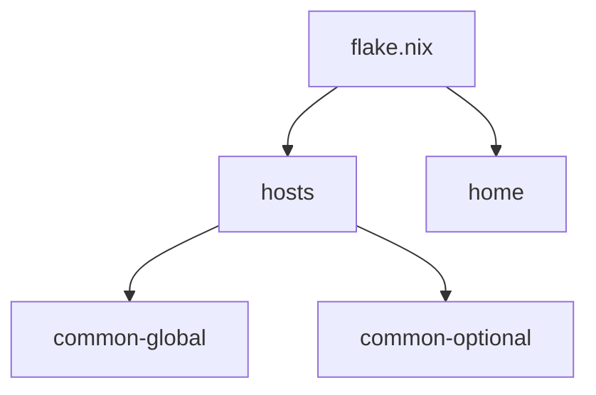

# Repository Improvement TODOs

Generated: 2026-03-21
Last Updated: 2026-03-22

## ✅ Completed

**P0 (Cleanup):**

- ✅ #2 - Remove commented-out code
- ✅ #7 - Resolve TODOs
- ✅ #20 - Remove unused files

**P1 (Consistency):**

- ✅ #1 - Consolidate mkSecret calls
- ✅ #11 - Extract common host config
- ⏭️ #9 - Rebuild aliases (already existed: `hms`, `snrs`)

**P2 (Quick Wins):**

- ✅ #3 - Simplify overlay application
- ✅ #6 - Add pre-commit hooks configuration
- ✅ #8 - Add update automation script
- ⏭️ #17 - Age key backup warning (user has separate backup strategy)
- ⏭️ #19 - Optimize GC (current settings fine)

**P3 (Nice-to-Have):**

- ✅ #18 - Enable Nix daemon optimizations (framework only)
- ⏭️ #4 - Add flake-parts (too much effort for value)
- ⏭️ #16 - Pin inputs (current approach better)
- ⏭️ #21 - Extract fish logic (not needed)

---

## 📊 Remaining Items

**P2 - Medium Priority (not started):**

- #5 - Parameterize host configs
- #10 - Standardize home-manager module imports
- #12 - Standardize secret naming
- #22 - Consolidate shell scripts

**P3 - Documentation:**

- #13 - Add per-directory READMEs
- #14 - Document custom modules
- #15 - Add architecture diagram

**P3 - Deferred (to revisit later):**

- #23 - Add per-project devShells
- #24 - Template for new features

---

## 🔄 Remaining P2 Items (Medium Priority)

### 5. **Parameterize host configs**

Both hosts have hardcoded stateVersion, boot config, etc. Create a `hostConfig` option.

**Files to modify:**

- `lib/mkHost.nix`
- `flake.nix`
- `hosts/framework/default.nix`
- `hosts/homelab/default.nix`

---

### 10. **Standardize home-manager module imports**

Some features use explicit imports, others don't. Be consistent.

**Files to audit:**

- All `home/om/features/*/default.nix`

---

### 12. **Standardize secret naming**

You use both underscores and hyphens. Be consistent: either all underscores or all hyphens.

**Files to audit:**

- All `secrets.yaml` files
- `lib/mkSecret.nix`

---

### 22. **Consolidate shell scripts**

Your `scripts/` are ad-hoc. Move them to `pkgs/` as proper derivations or add to home packages.

**Files to consider:**

- `scripts/cleanup_k3.sh`
- `scripts/transfer_k3s_config.sh`

---

## 📚 P3 Documentation Items

### 13. **Add per-directory READMEs**

Add `README.md` in key directories:

- `hosts/` - explain host architecture
- `home/om/features/` - explain feature organization
- `pkgs/` - document packaging patterns

**Files to create:**

- `hosts/README.md`
- `home/om/features/README.md`
- `pkgs/README.md`

---

### 14. **Document custom modules**

Your custom modules lack documentation:

```nix
# modules/home-manager/i3scaling.nix
{ lib, ... }:
{
  meta.maintainers = [ "om" ];
  meta.doc = ''
    Sets DPI, font sizes, and cursor size for HiDPI displays in i3wm.
  '';

  options.i3scaling = { ... };
}
```

**Files to modify:**

- `modules/home-manager/fonts.nix`
- `modules/home-manager/i3scaling.nix`
- `modules/home-manager/monitors.nix`
- `modules/home-manager/wallpaper.nix`
- `modules/nixos/smartd.nix`

---

### 15. **Add architecture diagram**

Your AGENTS.md has a text diagram. Consider a Mermaid diagram:



**Files to modify:**

- `AGENTS.md`

---

## 🎨 P3 Deferred Items

### 23. **Add per-project devShells**

Consider if flake templates (#24) cover this use case first.

**Decision:** Revisit after implementing templates.

---

### 24. **Template for new features**

Add flake templates for common project types:

```text
templates/
├── rust/
│   ├── flake.nix
│   ├── .envrc
│   └── .gitignore
├── python/
│   ├── flake.nix
│   ├── .envrc
│   └── pyproject.toml
└── node/
    ├── flake.nix
    ├── .envrc
    └── package.json
```

**Usage:**

```bash
nix flake init -t ~/nix-config#rust
```

**Files to create:**

- `templates/rust/flake.nix`
- `templates/python/flake.nix`
- `templates/node/flake.nix`
- Update `flake.nix` to export templates

**Decision:** Deferred to revisit later.

---

## 🎯 Suggested Next Steps

1. **Quick documentation wins** (~1 hour):
   - #13 - Add READMEs
   - #15 - Add Mermaid diagram

2. **Code consistency** (~1 hour):
   - #3 - Clean up overlay code
   - #12 - Standardize secret naming

3. **Templates** (when needed):
   - #24 - Create project templates
   - #23 - Evaluate if devShells still needed
